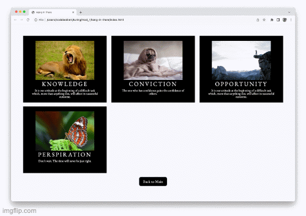

# Hang in There  

### Abstract:
[//]: <> (Briefly describe what you built and its features. What problem is the app solving? How does this application solve that problem?)  
***We built a website that allows a user to get random motivational posters, create their own posters, and save posters at their discretion. Saved posters can be seen in a grid, and can be removed at the user's discretion.***

### Installation Instructions:
[//]: <> (What steps does a person have to take to get your app cloned down and running?)  
***Users have to fork and clone from a gitHub link, open in a text editor to view code, and run 'open index.html' to view the site in the browser. Also, deployed page available [here.](https://cOdeBedient.github.io/hang-in-there/)***

### Preview of App:
[//]: <> (Provide ONE gif or screenshot of your application - choose the "coolest" piece of functionality to show off.)  
***This is a gif of our removeElement function in action!***  

### Context:
[//]: <> (Give some context for the project here. How long did you have to work on it? How far into the Turing program are you?)  
***We are in Mod 1! Only two weeks in. The project took us about 15 hours to complete.***

### Contributors:
[//]: <> (Who worked on this application? Link to their GitHubs.)
***Adam Bedient: https://github.com/cOdeBedient***  
***Lydia Sims: https://github.com/LISims88***  

### Learning Goals:
[//]: <> (What were the learning goals of this project? What tech did you work with?)  
***Our learning goal was to learn how to work with the DOM by writing javascript as it referenced and affected HTML and CSS. Specifically, we explored:***  
- ***Event Listeners***
- ***querySelector variables***
- ***inserting, removing and modifying classes to HTML elements***
- ***accessing hidden CSS styles***
- ***javascript fundamentals (still working on these!)***

### Wins + Challenges:
[//]: <> (What are 2-3 wins you have from this project? What were some challenges you faced - and how did you get over them?)
***Holy moly too many to count!***
1. ***Getting the pages to toggle seemlessly was exciting! We had to figure out how to access the .hidden class in CSS and toggle it on and off on button clicks through HTML. So cool to see it finally work!***
2. ***Getting the posters to delete on double click was HARD. We ended up doing lots of internet research, cohort brainstorming, Slack messaging, etc. etc. to compile the necessary components to finally succeed.***
3. ***The first successful use of a quesrySelector variable felt like magic!***
